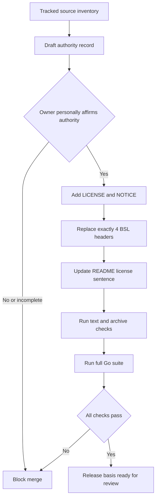

# Phase 1: Apache 2.0 Release Basis - Research

**Researched:** 2026-08-12
**Domain:** License provenance, release metadata, and source-tree integrity
**Confidence:** HIGH for repository facts and release mechanics. Owner authority requires human confirmation.

<user_constraints>
## User Constraints (from CONTEXT.md)

### Locked Decisions

### Relicense Authority Record
- **D-01:** Create a tracked `docs/relicense-authorization.md` record before the relicense merges.
- **D-02:** The record must identify the repository, the distributed first-party code in scope, the current BSL-marked files, the effective date, and the owner granting Apache License 2.0 permission.
- **D-03:** Shreyansh Sancheti must personally review and affirm the authority statement. Git authorship and `Signed-off-by` trailers are supporting evidence, not legal authorization.
- **D-04:** The phase remains blocked if the owner cannot confirm authority over all distributed first-party code. Planning and mechanical preparation may proceed, but merge approval may not.

### NOTICE Identity
- **D-05:** Use the existing source identity without inventing a legal suffix: `AgentGate` and `Copyright 2026 Clawdlinux.`
- **D-06:** Keep `NOTICE` minimal. Add third-party notices only when a distributed artifact creates an actual notice obligation supported by license evidence.

### Go Header Coverage
- **D-07:** Replace the incompatible headers in exactly these four files: `cmd/agentgw/main.go`, `internal/gateway/gateway.go`, `internal/registry/registry.go`, and `internal/vault/vault.go`.
- **D-08:** Use the established 4-line Apache header from `../agentic-operator-core/pkg/audit/chain.go`, preserving `Copyright 2026 Clawdlinux.`
- **D-09:** Do not add headers to unrelated headerless Go files. The release scan proves no incompatible BSL text remains across all first-party Go files.

### README License Wording
- **D-10:** Keep the existing `## License` section and replace its BSL sentence with a concise Apache License 2.0 statement linked to `LICENSE`.
- **D-11:** Do not add legal interpretation, patent summaries, badges, or open-source marketing claims in this phase.

### Claude's Discretion
- Exact prose and headings inside the authority record, provided D-01 through D-04 remain explicit.
- Exact validation command names and test placement.
- Whether the `LICENSE` link sentence says "licensed under" or "available under."

### Deferred Ideas (OUT OF SCOPE)

None. Discussion stayed within Phase 1.
</user_constraints>

<phase_requirements>
## Phase Requirements

| ID | Description | Research Support |
|----|-------------|------------------|
| LIC-01 | Record authority over every distributed first-party file before merge. | Use a revision-bound owner affirmation and a manual merge gate. [VERIFIED: REQUIREMENTS.md, 01-CONTEXT.md] |
| LIC-02 | Include unmodified Apache 2.0 text and an accurate `NOTICE`. | Copy canonical text unchanged. Keep source-checkout NOTICE factual. [CITED: apache.org/legal/apply-license.html] |
| LIC-03 | Remove BSL text and use Apache-compatible Go notices. | Replace exactly 4 headers. Scan every tracked Go file. [VERIFIED: repository grep] |
| LIC-04 | Identify Apache 2.0 in README and link `LICENSE`. | Replace only the existing license sentence. [VERIFIED: README.md, 01-CONTEXT.md] |
</phase_requirements>

## Summary

This phase is a release-integrity change. It must not alter runtime behavior. [VERIFIED: 01-CONTEXT.md]

The first work unit records owner authority. The owner must affirm it before merge. [VERIFIED: D-01 through D-04]

The second work unit adds release files and replaces exactly 4 headers. [VERIFIED: D-05 through D-11]

Apache permits others to use Apache License 2.0. It recommends a root `LICENSE` and optional `NOTICE`. [CITED: apache.org/foundation/license-faq.html]

Apache guidance cannot establish AgentGate ownership. Treat authority as a human legal representation. [CITED: apache.org/legal/apply-license.html]

**Primary recommendation:** Plan owner attestation first, then perform one narrow mechanical licensing change.

## Architectural Responsibility Map

| Capability | Primary Tier | Secondary Tier | Rationale |
|------------|-------------|----------------|-----------|
| Relicense authority | Release governance | Repository documentation | A human owner grants permission. The repository records that decision. [VERIFIED: D-01 through D-04] |
| License terms | Distribution root | Source headers | `LICENSE` governs the distribution. Headers preserve detached-file context. [CITED: apache.org/foundation/license-faq.html] |
| Attribution | Distribution root | Artifact packaging | `NOTICE` carries informational attribution. Packaged dependencies may add obligations. [CITED: Apache-2.0 Section 4(d)] |
| README statement | Repository documentation | Distribution root | README names the license and links its authoritative local text. [VERIFIED: LIC-04] |
| Release validation | CI or reviewer shell | Human approval | Automated scans prove text state. Only the owner can affirm authority. [VERIFIED: D-03, D-04] |

## Project Constraints (from CLAUDE.md)

- Use short sentences. Avoid em dashes and corporate wording. [VERIFIED: CLAUDE.md]
- Do not rewrite the existing gateway. [VERIFIED: PRD-receipts-oss.md]
- Use standard Go layout and table-driven tests for code changes. [VERIFIED: .github/copilot-instructions.md]
- Keep runtime behavior unchanged during this phase. [VERIFIED: 01-CONTEXT.md]
- Change only the phase's licensing files. [VERIFIED: D-01 through D-11]
- Do not treat Git authorship or DCO trailers as relicensing authority. [VERIFIED: D-03]
- Do not merge without the owner's written affirmation. [VERIFIED: D-04]

## Current Repository Evidence

| Finding | Evidence | Planning Impact |
|---------|----------|-----------------|
| Root `LICENSE` is absent. | Direct filesystem check. [VERIFIED: repository scan] | Add canonical Apache 2.0 text. |
| Root `NOTICE` is absent. | Direct filesystem check. [VERIFIED: repository scan] | Add the locked 2-line identity. |
| Authority record is absent. | Direct filesystem check. [VERIFIED: repository scan] | Create it before merge. |
| Exactly 4 tracked Go files contain BSL text. | `git ls-files '*.go'` plus `rg`. [VERIFIED: repository scan] | Replace only those headers. |
| README names BSL and links missing `LICENSE`. | Direct file read. [VERIFIED: README.md] | Replace one sentence. |
| No vendored or third-party source tree is tracked. | Tracked-path scan. [VERIFIED: repository scan] | Source NOTICE can remain minimal. |
| Git history shows one author identity. | `git log --format`. [VERIFIED: git history] | Supporting evidence only. |
| Existing full Go suite passes. | `go test ./...`. [VERIFIED: local execution] | Preserve this baseline. |

## Standard Stack

### Core Artifacts

| Artifact | Version or Form | Purpose | Required Form |
|----------|-----------------|---------|---------------|
| Apache License | 2.0, January 2004 | Distribution license | Unmodified canonical English text. [CITED: apache.org/licenses/LICENSE-2.0.txt] |
| SPDX identifier | `Apache-2.0` | Machine-readable license identity | Use only where selected by project policy. [CITED: spdx.org/licenses/Apache-2.0.html] |
| Source header | Existing 4-line project form | Replace BSL notices | Copy sibling header exactly. [VERIFIED: D-08] |
| NOTICE | Plain text | Distribution attribution | `AgentGate` and locked copyright line. [VERIFIED: D-05, D-06] |
| Authority record | Markdown | Human merge-gate evidence | Revision-bound owner affirmation. [VERIFIED: D-01 through D-04] |

No package installation is required. [VERIFIED: phase scope]

## Architecture Patterns

### Release Decision Flow



### Recommended Change Map

```text
LICENSE                                  # Canonical Apache License 2.0 text
NOTICE                                   # Locked AgentGate identity
docs/relicense-authorization.md          # Owner authority record and affirmation
README.md                                # Existing license sentence only
cmd/agentgw/main.go                      # Header replacement only
internal/gateway/gateway.go              # Header replacement only
internal/registry/registry.go            # Header replacement only
internal/vault/vault.go                  # Header replacement only
```

### Pattern 1: Revision-Bound Authority Record

**What:** Bind the affirmation to a repository and a reviewable source revision.

**Why:** A general statement can leave later files or imported code ambiguous. [ASSUMED]

**Recommended fields:**

1. Repository URL and repository name. [VERIFIED: D-02]
2. Effective date. [VERIFIED: D-02]
3. Owner name granting permission. [VERIFIED: D-02]
4. Scope covering every distributed first-party file at the named revision. [VERIFIED: LIC-01]
5. The 4 current BSL-marked paths. [VERIFIED: D-02, D-07]
6. Permission to release that scope under Apache License 2.0. [VERIFIED: D-02]
7. A statement that third-party works retain their own terms. [ASSUMED]
8. Owner affirmation with typed name and review date. [VERIFIED: D-03]
9. A warning that authorship and sign-off are not authorization. [VERIFIED: D-03]

Use the reviewed commit SHA or release commit as the revision identifier. [ASSUMED]

### Pattern 2: Canonical Root License

Copy the canonical license text without project-specific additions. [CITED: apache.org/legal/apply-license.html]

Keep project identity in `NOTICE` and source headers. [VERIFIED: D-05, D-08]

The sibling `LICENSE` matches the expected Apache 2.0 form. [VERIFIED: local file inspection]

### Pattern 3: Minimal NOTICE

Use exactly this project identity:

```text
AgentGate
Copyright 2026 Clawdlinux.
```

This wording is locked. [VERIFIED: D-05]

Apache Section 4(d) says NOTICE content is informational. It cannot modify the license. [CITED: apache.org/licenses/LICENSE-2.0.txt]

Do not copy ASF-specific boilerplate. AgentGate is not an ASF project. [CITED: apache.org/legal/src-headers.html]

The tracked source tree does not contain dependency source or media assets. [VERIFIED: repository scan]

Future binary packaging needs a separate dependency-license review. [ASSUMED]

`gopkg.in/yaml.v3` carries its own `NOTICE` in the module cache. [VERIFIED: module cache inspection]

That fact alone does not decide AgentGate binary NOTICE contents. Obtain legal review if packaging is unclear. [ASSUMED]

### Pattern 4: Exact Header Replacement

Use this exact header in the 4 locked files:

```go
/*
Copyright 2026 Clawdlinux.
Licensed under the Apache License, Version 2.0.
*/
```

The form comes from the sibling audit package. [VERIFIED: agentic-operator-core/pkg/audit/chain.go]

Do not add it to other Go files. [VERIFIED: D-09]

### Anti-Patterns to Avoid

- **Authorship as authority:** Git history does not prove ownership or employer consent. [VERIFIED: D-03]
- **DCO as relicensing grant:** A sign-off is supporting provenance, not retroactive authorization. [VERIFIED: D-03]
- **Editing the license:** Modified terms are not the standard Apache License. [CITED: apache.org/foundation/license-faq.html]
- **ASF boilerplate:** ASF-specific headers reflect ASF contributor agreements. [CITED: apache.org/foundation/license-faq.html]
- **Broad header churn:** This phase changes exactly 4 existing headers. [VERIFIED: D-07, D-09]
- **Speculative NOTICE entries:** Add notices only for evidenced obligations in distributed artifacts. [VERIFIED: D-06]
- **Runtime cleanup:** Do not refactor imports, comments, formatting, or behavior. [VERIFIED: phase boundary]
- **Marketing copy:** Do not add badges, patent summaries, or open-source claims. [VERIFIED: D-11]

## Don't Hand-Roll

| Problem | Don't Build | Use Instead | Why |
|---------|-------------|-------------|-----|
| License text | A shortened or edited license | Canonical Apache text | Exact standard terms reduce ambiguity. [CITED: apache.org/licenses/LICENSE-2.0.txt] |
| License identifier | A custom name | `Apache-2.0` | SPDX publishes this identifier. [CITED: spdx.org/licenses/Apache-2.0.html] |
| Legal authority inference | A Git-based ownership algorithm | Owner affirmation and counsel when needed | Repository metadata cannot settle ownership. [VERIFIED: D-03, D-04] |
| Header format | A new project header | Locked sibling 4-line header | Consistency is a user decision. [VERIFIED: D-08] |
| NOTICE generator | Dependency-name dumping | Evidence review per shipped artifact | NOTICE is not a dependency inventory. [CITED: Apache-2.0 Section 4(d)] |

**Key insight:** Automation can prove repository state. It cannot prove the owner's legal authority.

## Common Pitfalls

### Pitfall 1: The Authority Record Is Unbounded

**What goes wrong:** The statement does not identify the reviewed source scope.

**Why it happens:** Repository names remain stable while contents change. [ASSUMED]

**How to avoid:** Name the repository, effective date, file scope, and revision. [VERIFIED: D-02, LIC-01]

**Warning sign:** The record says only that the repository is sole-authored.

### Pitfall 2: Mechanical Changes Merge Before Affirmation

**What goes wrong:** Apache labels appear without confirmed permission.

**Why it happens:** Automated checks pass before the human gate. [ASSUMED]

**How to avoid:** Make owner affirmation a blocking phase-level check. [VERIFIED: D-03, D-04]

**Warning sign:** The review checklist has no owner-attestation item.

### Pitfall 3: A Source Scan Includes Planning Documents

**What goes wrong:** `rg "Business Source" .` finds historical planning text.

**Why it happens:** Planning files intentionally describe the old license. [VERIFIED: repository scan]

**How to avoid:** Scan tracked Go files for LIC-03. Check release artifacts separately.

**Warning sign:** Validation fails on `01-CONTEXT.md` instead of distributed code.

### Pitfall 4: NOTICE Becomes a Dependency Dump

**What goes wrong:** Package names appear without a demonstrated notice obligation.

**Why it happens:** License inventory and NOTICE serve different purposes. [CITED: Apache-2.0 Section 4(d)]

**How to avoid:** Tie each added notice to a shipped artifact and license evidence. [VERIFIED: D-06]

**Warning sign:** NOTICE mirrors `go.mod` without reviewing licenses or packaging.

### Pitfall 5: Source Checkout and Binary Distribution Are Conflated

**What goes wrong:** A source-only audit is presented as binary-release clearance.

**Why it happens:** Go dependencies are not vendored but may be compiled into binaries. [VERIFIED: repository and module scans]

**How to avoid:** State that this phase validates the source checkout. Review binary packaging separately. [VERIFIED: LIC-02]

**Warning sign:** Release notes claim every future artifact is cleared.

## Code Examples

### Verify the Canonical License Copy

```bash
cmp -s LICENSE ../agentic-operator-core/LICENSE
```

This is a local reproducible check against the reviewed sibling copy. [VERIFIED: local files]

For source review, compare against the official canonical URL. [CITED: apache.org/licenses/LICENSE-2.0.txt]

### Verify Exactly 4 Apache Headers

```bash
expected='cmd/agentgw/main.go
internal/gateway/gateway.go
internal/registry/registry.go
internal/vault/vault.go'

actual=$(git ls-files '*.go' | xargs rg -l \
  'Licensed under the Apache License, Version 2\.0\.' | sort)
test "$actual" = "$expected"
```

### Verify No BSL Text Remains in Tracked Go Files

```bash
if git ls-files '*.go' | xargs rg -n 'Business Source License|Business Source|BSL'; then
  exit 1
fi
```

### Verify README License Link

```bash
rg -n '^## License$' README.md
rg -n 'Apache License 2\.0.*\[LICENSE\]\(LICENSE\)' README.md
```

### Verify Source Archive Contents

```bash
archive=$(mktemp -t agentgate-source.XXXXXX.tar)
git archive --format=tar --output="$archive" HEAD
tar -tf "$archive" | rg '^(LICENSE|NOTICE|docs/relicense-authorization\.md)$'
rm -f "$archive"
```

Run this after the licensing files are committed. [VERIFIED: git archive behavior]

## State of the Art

| Old Approach | Current Approach | Impact |
|--------------|------------------|--------|
| Custom license labels | SPDX identifier `Apache-2.0` | Tools can identify the standard license. [CITED: SPDX license list] |
| Full license in every source file | One root license plus source notices | Detached files remain identifiable without duplicating full terms. [CITED: Apache FAQ] |
| NOTICE as extra license terms | NOTICE as informational attribution | NOTICE cannot modify Apache 2.0. [CITED: Section 4(d)] |

**Deprecated or inapplicable:**

- Apache License 1.0 and 1.1 are older versions. [CITED: apache.org/foundation/license-faq.html]
- ASF source-header policy does not govern non-ASF projects. [CITED: apache.org/legal/src-headers.html]

## Assumptions Log

| # | Claim | Section | Risk if Wrong |
|---|-------|---------|---------------|
| A1 | Binding the authority record to a commit SHA improves scope clarity. | Architecture Patterns | The owner may prefer another revision identifier. |
| A2 | The record should exclude third-party works from first-party authority. | Architecture Patterns | Exact legal wording may require counsel. |
| A3 | Future binary packaging needs a separate dependency-license review. | Architecture Patterns | Current release packaging may already include binaries. |
| A4 | Automated-check timing can let mechanical changes outrun human approval. | Common Pitfalls | Low impact. The explicit merge gate still controls. |

## Open Questions (RESOLVED)

1. **Can Shreyansh Sancheti affirm authority over every distributed first-party file?**
   - Resolution: Authority is a mandatory blocking human checkpoint. Shreyansh Sancheti must personally record exact `Status: Affirmed`, reviewer, and review-date fields. Pending or uncertain authority stops execution and blocks merge. Git history and sign-off remain supporting evidence only. [VERIFIED: D-03, D-04]

2. **Will this phase produce only a source checkout or also a binary artifact?**
   - Resolution: R1 validates the source checkout only. Binary dependency and NOTICE review remain outside Phase 1. They must occur before any binary distribution claim. [VERIFIED: LIC-02, phase boundary]

## Environment Availability

| Dependency | Required By | Available | Version | Fallback |
|------------|-------------|-----------|---------|----------|
| Go | Regression tests | Yes | Project declares 1.25.0 | CI with matching Go version. [VERIFIED: go.mod] |
| Git | Tracked scans and archive checks | Yes | Repository commands succeeded | None required. [VERIFIED: local execution] |
| ripgrep | Text scans | Yes | Commands succeeded | POSIX `grep`. [VERIFIED: local execution] |
| tar | Archive inspection | Yes | Command available on macOS | `git archive --list`. [ASSUMED] |

**Missing dependencies with no fallback:** None found. [VERIFIED: local execution]

## Validation Architecture

### Test Framework

| Property | Value |
|----------|-------|
| Framework | Go test, plus shell release checks. [VERIFIED: Makefile] |
| Config file | No separate Go test configuration. [VERIFIED: repository scan] |
| Quick run command | `go test ./cmd/agentgw ./internal/gateway ./internal/registry ./internal/vault` |
| Full suite command | `go test ./...` |

### Phase Requirements to Test Map

| Req ID | Behavior | Test Type | Automated Command | File Exists? |
|--------|----------|-----------|-------------------|--------------|
| LIC-01 | Authority record covers first-party scope. | Manual gate plus text check | `test -s docs/relicense-authorization.md` | No. Wave 0 creates it. |
| LIC-02 | Canonical license and accurate NOTICE exist. | Release check | `cmp -s LICENSE ../agentic-operator-core/LICENSE && test -s NOTICE` | No. Wave 0 creates both. |
| LIC-03 | Exactly 4 headers changed and no Go BSL remains. | Release check | Use the exact header and BSL commands above. | Commands documented here. |
| LIC-04 | README names Apache 2.0 and links LICENSE. | Release check | `rg -n 'Apache License 2\.0.*\[LICENSE\]\(LICENSE\)' README.md` | Existing README needs edit. |

### Fast Per-Task Checks

**Authority-record task:**

```bash
test -s docs/relicense-authorization.md
rg -n 'AgentGate|github.com/Clawdlinux/agentgate|Apache License 2\.0|Shreyansh Sancheti' \
  docs/relicense-authorization.md
```

Then perform the manual owner-attestation check below.

**Mechanical licensing task:**

```bash
cmp -s LICENSE ../agentic-operator-core/LICENSE
printf 'AgentGate\nCopyright 2026 Clawdlinux.\n' | cmp -s - NOTICE
if git ls-files '*.go' | xargs rg -n 'Business Source License|Business Source|BSL'; then exit 1; fi
rg -n 'Apache License 2\.0.*\[LICENSE\]\(LICENSE\)' README.md
go test ./cmd/agentgw ./internal/gateway ./internal/registry ./internal/vault
```

### Manual Owner-Attestation Verification

The reviewer must confirm all items before merge:

- The tracked authority record names the correct repository. [VERIFIED: D-02]
- It covers every distributed first-party file. [VERIFIED: LIC-01]
- It lists the 4 current BSL-marked files. [VERIFIED: D-02, D-07]
- It states the effective date and Apache 2.0 permission. [VERIFIED: D-02]
- Shreyansh Sancheti personally reviewed and affirmed it. [VERIFIED: D-03]
- The affirmation does not rely on authorship or sign-off alone. [VERIFIED: D-03]
- Any authority uncertainty blocks merge. [VERIFIED: D-04]

This check is not automatable. Record the review in the pull request checklist. [ASSUMED]

### Phase-Level Checks

```bash
go test ./...

git diff --check "$R1_BASELINE...HEAD" -- . ':(exclude).planning/**'

test -s docs/relicense-authorization.md
cmp -s LICENSE ../agentic-operator-core/LICENSE
printf 'AgentGate\nCopyright 2026 Clawdlinux.\n' | cmp -s - NOTICE

if git ls-files '*.go' | xargs rg -n 'Business Source License|Business Source|BSL'; then
  exit 1
fi

test "$(git ls-files '*.go' | xargs rg -l \
  'Licensed under the Apache License, Version 2\.0\.' | sort | wc -l | tr -d ' ')" = 4

rg -n '^## License$' README.md
rg -n 'Apache License 2\.0.*\[LICENSE\]\(LICENSE\)' README.md
```

After commit, also run the source archive check from `Code Examples`.

### Sampling Rate

- **Per task:** Run that task's release checks.
- **Per plan completion:** Run touched-package tests and `git diff --check "$R1_BASELINE...HEAD" -- . ':(exclude).planning/**'`.
- **Phase gate:** Run all phase checks and manual owner verification.
- **Merge gate:** Owner affirmation must exist before merge. [VERIFIED: D-04]

### Wave 0 Gaps

- [ ] Create `docs/relicense-authorization.md` with owner-review fields.
- [ ] Add root `LICENSE` and `NOTICE`.
- [ ] Add executable release checks to the plan actions or reviewer checklist.

A permanent test script is optional. The commands are short and phase-specific. [ASSUMED]

## Security Domain

This phase does not need a broad application threat model. Runtime behavior is unchanged. [VERIFIED: phase boundary]

Use a narrow supply-chain and license-integrity review. [ASSUMED]

### Applicable ASVS Categories

| ASVS Category | Applies | Standard Control |
|---------------|---------|-----------------|
| V2 Authentication | No | No runtime changes. [VERIFIED: phase boundary] |
| V3 Session Management | No | No runtime changes. [VERIFIED: phase boundary] |
| V4 Access Control | No | Human merge approval covers owner authority. [VERIFIED: D-04] |
| V5 Input Validation | No | No new runtime input. [VERIFIED: phase boundary] |
| V6 Cryptography | No | No cryptographic implementation changes. [VERIFIED: phase boundary] |

### License-Integrity Threats

| Pattern | STRIDE | Standard Mitigation |
|---------|--------|---------------------|
| Unauthorized relicense statement | Spoofing | Personal owner affirmation and blocked merge. [VERIFIED: D-03, D-04] |
| Modified canonical license text | Tampering | Byte comparison against reviewed canonical text. [CITED: official Apache text] |
| Omitted required attribution | Repudiation | Tracked inventory and artifact-specific notice review. [ASSUMED] |
| Misleading README license claim | Spoofing | Link README wording to root `LICENSE`. [VERIFIED: LIC-04] |
| Hidden BSL residue | Tampering | Scan every tracked first-party Go file. [VERIFIED: LIC-03] |

The plan should not add application-security tasks. They are outside this phase. [VERIFIED: phase boundary]

## Sources

### Primary (HIGH confidence)

- https://www.apache.org/licenses/LICENSE-2.0.txt
  - Canonical license text and Section 4(d) NOTICE rules.
- https://www.apache.org/foundation/license-faq.html
  - Applying Apache 2.0 outside the ASF and short header options.
- https://www.apache.org/legal/apply-license.html
  - Root LICENSE guidance and ownership caveat.
- https://www.apache.org/legal/src-headers.html#notice
  - NOTICE purpose and explicit non-ASF policy boundary.
- https://spdx.org/licenses/Apache-2.0.html
  - Official SPDX short identifier.
- `01-CONTEXT.md`, `REQUIREMENTS.md`, `ROADMAP.md`, and `PRD-receipts-oss.md`
  - Locked scope, requirements, and merge gate.
- Repository scans and local test execution on 2026-08-12.
  - Current file state, dependency evidence, and green baseline.

### Secondary (MEDIUM confidence)

- None.

### Tertiary (LOW confidence)

- None. Unverified conclusions are listed in the Assumptions Log.

## Metadata

**Confidence breakdown:**

- Standard artifacts: HIGH. Apache and SPDX primary sources were checked.
- Repository scope: HIGH. Tracked files and current headers were scanned.
- Validation: HIGH. Commands ran against the current repository baseline.
- Owner authority: LOW until personal affirmation. Repository metadata cannot prove it.
- Binary NOTICE scope: LOW. The current phase defines source-checkout acceptance.

**Research date:** 2026-08-12
**Valid until:** 2026-09-11 for source guidance. Recheck before changing artifact formats.
