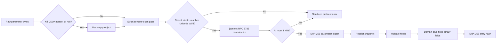

# Phase 02: Receipt Protocol - Research

**Researched:** 2026-08-13
**Domain:** Strict RFC 8785 digests and deterministic binary receipt hashes
**Confidence:** HIGH

<user_constraints>
## User Constraints (from CONTEXT.md)

### Locked Decisions

#### Hash Boundary And Domain Separation
- **D-01:** Canonical bytes mean the entry-hash preimage. They are not a persistence format, JSONL format, or complete binary receipt record.
- **D-02:** Prefix every hash input with the exact ASCII bytes `agentgate.receipt.hash.v1` followed by one NUL byte. A protocol change requires a new domain version.
- **D-03:** Encode fields after the domain in this exact order: `seq`, `timestamp_unix_ns`, `human_principal`, `agent_key_id`, `delegation_chain`, `service`, `action`, `params_sha256`, `policy_decision`, `status_code`, `latency_ms`, `error`, `prev_hash`, `signer_kid`.
- **D-04:** Exclude `entry_hash` and `signature` from the hash input because they are derived. Include `signer_kid` so changing key identity changes `entry_hash`.
- **D-05:** `entry_hash` is SHA-256 over the complete canonical hash input. Phase 3 signs this 32-byte hash with Ed25519.

#### Field Types, Encoding, And Bounds
- **D-06:** Keep the PRD Go field types. Encode `uint64` values as 8-byte little-endian. Encode `status_code` as signed 4-byte little-endian after range validation. Encode `latency_ms` as signed 8-byte little-endian.
- **D-07:** Encode strings as uint32 little-endian byte length followed by exact UTF-8 bytes. Require valid UTF-8, reject NUL, and perform no Unicode normalization.
- **D-08:** Encode `delegation_chain` as uint32 little-endian element count followed by ordered length-prefixed elements. R2 produces an empty list but the encoder supports the future field.
- **D-09:** Require `seq >= 1`, `timestamp_unix_ns >= 1`, `100 <= status_code <= 599`, and `latency_ms >= 0`. Never clamp or coerce invalid values.
- **D-10:** Require nonempty `human_principal`, `agent_key_id`, `service`, `action`, `policy_decision`, and `signer_kid`. Byte limits are 256, 128, 64, 128, 16, and 128 respectively.
- **D-11:** Limit `delegation_chain` to 32 ordered elements and each element to 64 ASCII bytes. Limit `error` to 64 ASCII bytes.

#### Parameter Digest Semantics
- **D-12:** Canonicalize parameters using RFC 8785 JSON Canonicalization Scheme. Use a maintained standards implementation. Do not hand-roll JSON number or string canonicalization.
- **D-13:** `DigestParams` accepts raw JSON bytes so duplicate object names can be rejected before data is collapsed into a Go map. Phase 4 may adapt request decoding later.
- **D-14:** The top-level parameter value must be an object. Omitted bytes, whitespace-only bytes, or JSON `null` normalize to the empty object `{}`.
- **D-15:** Reject duplicate names, invalid Unicode, non-I-JSON numbers, nesting beyond 32 levels, and canonical output above 1 MiB. Do not coerce invalid input.
- **D-16:** Hash the RFC 8785 bytes with SHA-256 and return only `[32]byte`. `Receipt` never stores raw or canonical parameter JSON.

#### Privacy And Closed Vocabularies
- **D-17:** `policy_decision` accepts exactly `allow`, `deny`, or `rate_limited`. Encode the selected ASCII string as length-prefixed bytes.
- **D-18:** `error` is empty or matches `^[a-z0-9_]{1,64}$`. It is a stable machine code only. Never include provider messages, response bodies, tokens, or request content.
- **D-19:** Receipt fields may contain identifiers required by the PRD, but no field may contain OAuth tokens, raw parameters, upstream bodies, or unrestricted provider errors.

#### Package API And Fixtures
- **D-20:** Expose a small pure API centered on `Receipt`, `Validate`, `DigestParams`, `CanonicalHashInput`, and `ComputeEntryHash`. Return errors for invalid input. Do not mutate caller slices.
- **D-21:** Keep signing, key generation, key rotation, database interfaces, request middleware, and export formats out of `internal/receipt` during R2.
- **D-22:** Prove encoder independence with an external-package test reference encoder. It may use the public `Receipt` fields and protocol constants but cannot call production encoding helpers.
- **D-23:** Check in a human-readable fixture manifest plus immutable binary golden files and documented SHA-256 values. Cover genesis zero `prev_hash`, exact Unicode bytes, empty delegation, maximum integer values, and validation boundaries.
- **D-24:** Golden updates require an explicit protocol-version change and reviewed fixture replacement. Tests must never rewrite goldens automatically.

### Claude's Discretion
- Exact internal file split within `internal/receipt`.
- Choice of maintained RFC 8785 package after research verifies API, license, and duplicate-name behavior.
- Error type names and test helper names.
- Exact fixture case names and manifest schema.

### Deferred Ideas (OUT OF SCOPE)
- Ed25519 signing and key lifecycle belong to Phase 3.
- SQLite storage, sequencing, and request-path integration belong to Phase 4.
- JSONL and SQLite offline verification belong to Phase 5.
- Biscuit delegation validation and lineage production belong to Phase 8.
</user_constraints>

<phase_requirements>
## Phase Requirements

| ID | Description | Research Support |
|----|-------------|------------------|
| RCPT-01 | Fixed receipt fields, types, order, limits, and domain separation. | Exact grammar, maximum size, validation order, and reflection tests. [VERIFIED: 02-CONTEXT.md] |
| RCPT-02 | Equivalent objects produce one SHA-256 digest. | One pinned package handles strict parsing and canonicalization. [CITED: https://github.com/go-json-experiment/json/tree/4849db3c2f7e2cc8a9816ebf68aafb0a046dec5b/jsontext] |
| RCPT-03 | Receipts omit raw parameters and sensitive provider data. | Digest-only API, closed errors, and sentinel leakage tests. [VERIFIED: 02-CONTEXT.md] |
| RCPT-04 | Independent encoders produce identical bytes. | Production and `receipt_test` encoders compare every fixture. [VERIFIED: 02-CONTEXT.md] |
| RCPT-05 | Immutable fixtures cover required boundaries. | Versioned manifest, binary files, and fixed hashes. [VERIFIED: 02-CONTEXT.md] |
</phase_requirements>

## Summary

Use one pinned `jsontext` revision for strict parsing and RFC 8785 output. This reduces parser differential risk. [CITED: https://github.com/go-json-experiment/json/tree/4849db3c2f7e2cc8a9816ebf68aafb0a046dec5b/jsontext]

The package rejects duplicate decoded names, invalid UTF-8, and malformed surrogate escapes by default. [CITED: https://github.com/go-json-experiment/json/blob/4849db3c2f7e2cc8a9816ebf68aafb0a046dec5b/jsontext/doc.go]

A token pre-pass must add 3 checks. Enforce depth 32, reject Unicode noncharacters, and reject binary64 overflow. [CITED: https://www.rfc-editor.org/rfc/rfc7493.html]

Binary receipt encoding should use standard-library append APIs. Validate a private snapshot before appending any field. [CITED: https://pkg.go.dev/encoding/binary#AppendByteOrder]

**Primary recommendation:** Pin `github.com/go-json-experiment/json` and wrap `jsontext` with AgentGate's stricter limits. [ASSUMED]

## Architectural Responsibility Map

| Capability | Primary Tier | Secondary Tier | Rationale |
|------------|-------------|----------------|-----------|
| Receipt semantic contract | API / Backend | None | `internal/receipt` owns pure types and validation. [VERIFIED: 02-CONTEXT.md] |
| Parameter validation | API / Backend | None | Raw JSON must be checked before gateway maps collapse names. [VERIFIED: internal/gateway/gateway.go] |
| RFC 8785 digest | API / Backend | None | The package returns only a digest. [VERIFIED: D-16] |
| Binary hash preimage | API / Backend | None | This is a protocol primitive, not persistence. [VERIFIED: D-01] |
| Golden fixtures | Test / Audit boundary | API / Backend | Both implementations share fixed public bytes. [VERIFIED: RCPT-04, RCPT-05] |
| Signing | Out of scope | Phase 3 | Phase 2 computes hashes only. [VERIFIED: D-05, D-21] |
| Persistence and gateway wiring | Out of scope | Phase 4 | Existing request paths remain unchanged. [VERIFIED: D-21] |

## Project Constraints (from CLAUDE.md)

- Write direct technical prose. [VERIFIED: CLAUDE.md]
- Use sentences of at most 20 words. [VERIFIED: CLAUDE.md]
- Do not use em dashes. [VERIFIED: CLAUDE.md]
- Avoid the banned corporate and AI-style phrases. [VERIFIED: CLAUDE.md]
- AgentGate remains a thin OAuth and token gateway. [VERIFIED: CLAUDE.md]

Additional repository constraints affect planning:

- Use Go 1.25 syntax and module compatibility. [VERIFIED: go.mod]
- Keep dependencies injected. Do not add global mutable state. [VERIFIED: .github/copilot-instructions.md]
- Use table-driven tests and standard Go testing. [VERIFIED: .github/copilot-instructions.md]
- Wrap internal errors with package and function context. [VERIFIED: .github/copilot-instructions.md]
- Preserve the gateway. Do not wire Phase 2 into it. [VERIFIED: PRD-receipts-oss.md]
- Future commits require sign-off. This research task must not commit. [VERIFIED: .planning/REQUIREMENTS.md]

## Standard Stack

### Core

| Library | Version | Purpose | Why Standard |
|---------|---------|---------|--------------|
| Go | 1.25.0 | Package, hashing, encoding, tests, and fuzzing. | The repository pins this version. [VERIFIED: go.mod] |
| `github.com/go-json-experiment/json/jsontext` | `v0.0.0-20251027170946-4849db3c2f7e` | Strict tokens and RFC 8785 output. | This is the newest revision declaring Go 1.25. [VERIFIED: Go module proxy] [ASSUMED] |
| `crypto/sha256` | Go standard library | Parameter and entry hashes. | SHA-256 is locked. [VERIFIED: D-05, D-16] |
| `encoding/binary` | Go standard library | Fixed little-endian values and lengths. | It directly implements the locked byte order. [CITED: https://pkg.go.dev/encoding/binary] |

### Supporting

| Library | Purpose | When to use |
|---------|---------|-------------|
| `strconv` | Detect binary64 range errors. | Check every number token before canonicalization. [CITED: https://pkg.go.dev/strconv#ParseFloat] |
| `unicode/utf8` | Validate receipt field strings. | Check every string before binary encoding. [CITED: https://pkg.go.dev/unicode/utf8#ValidString] |
| `slices` | Copy `delegation_chain`. | Create an isolated receipt snapshot. [CITED: https://pkg.go.dev/slices#Clone] |
| `regexp` | Validate stable error codes. | Compile the fixed D-18 pattern once. [VERIFIED: D-18] |

### Alternatives Considered

| Instead of | Could Use | Tradeoff |
|------------|-----------|----------|
| Pinned `jsontext` | `github.com/gowebpki/jcs v1.0.1` | Stable API, but malformed Unicode cases pass. [VERIFIED: tagged source] |
| Pinned `jsontext` | `github.com/deszhou/jcs v1.0.0` | Recent API, but only 5 commits and similar gaps. [VERIFIED: GitHub API] |
| Pinned module | Go 1.25 `encoding/json/jsontext` | Ordinary builds require `GOEXPERIMENT=jsonv2`. [CITED: https://go.dev/blog/jsonv2-exp] |
| Strict tokens | `encoding/json` into `map[string]any` | It permits duplicates and replaces invalid Unicode. [CITED: https://go.dev/blog/jsonv2-exp] |

**Installation:**

```bash
go get github.com/go-json-experiment/json@v0.0.0-20251027170946-4849db3c2f7e
```

Expected checksum: `h1:Lf/gRkoycfOBPa42vU2bbgPurFong6zXeFtPoxholzU=`. [VERIFIED: Go module proxy]

## Package Legitimacy Audit

| Package | Registry | Age | Downloads | Source Repo | slopcheck | Disposition |
|---------|----------|-----|-----------|-------------|-----------|-------------|
| `github.com/go-json-experiment/json` | Go proxy | Created 2021 | Not published | `github.com/go-json-experiment/json` | Unavailable | Conditional approval. Add a human checkpoint. [ASSUMED] |

The Go JSON experiment team owns the repository. It uses BSD-3-Clause. [CITED: https://github.com/go-json-experiment/json]

BSD-3-Clause is Category A for Apache projects. [CITED: https://www.apache.org/legal/resolved.html#category-a]

The pin declares Go 1.25 and passed its `jsontext` tests locally. [VERIFIED: local execution]

`slopcheck` was unavailable. The package remains `[ASSUMED]` under the research safety rule. [VERIFIED: local environment]

**Packages removed due to `[SLOP]`:** None. The scanner did not run. [VERIFIED: local environment]

**Packages flagged as suspicious:** The planner must add a human verification checkpoint. [ASSUMED]

## JCS Implementation Findings

| Implementation | API and license | Duplicate names | Number behavior | Invalid Unicode | Maintenance | Decision |
|----------------|-----------------|-----------------|-----------------|-----------------|-------------|----------|
| Go `jsontext` pin | `Decoder`, `Value.Canonicalize`; BSD-3-Clause. [VERIFIED: tagged source] | Rejected by decoded name. [VERIFIED: tagged tests] | RFC formatting. Overflow saturates unless prechecked. [VERIFIED: source] | Invalid UTF-8 and surrogates fail. Noncharacters need a wrapper. [VERIFIED: source] | Pin dated 2025-10-27. Later module needs Go 1.26. [VERIFIED: Go proxy] | Use with the pre-pass. [ASSUMED] |
| `gowebpki/jcs v1.0.1` | `Transform([]byte)`; Apache-2.0. [VERIFIED: source] | Rejected, not collapsed. [VERIFIED: source] | RFC vectors pass above $2^{53}-1$. [VERIFIED: tests] | Raw invalid UTF-8 and malformed pairs can pass. [VERIFIED: source] | Last release 2023-10-15. [VERIFIED: Go proxy] | Reject. |
| `deszhou/jcs v1.0.0` | `Transform([]byte)`; Apache-2.0. [VERIFIED: source] | Rejected, not collapsed. [VERIFIED: tests] | RFC vectors include large integers. [VERIFIED: tests] | Raw invalid UTF-8 and malformed pairs can pass. [VERIFIED: source] | Repository began 2026-03-28. [VERIFIED: GitHub API] | Reject. |
| `encoding/json` v1 | Decoder and maps; BSD-3-Clause. [VERIFIED: Go docs] | Accepted and collapsed by maps. [CITED: https://go.dev/blog/jsonv2-exp] | Interfaces default to `float64`. [CITED: https://pkg.go.dev/encoding/json] | Invalid sequences become U+FFFD. [CITED: https://pkg.go.dev/encoding/json] | Stable legacy behavior. [CITED: https://pkg.go.dev/encoding/json] | Reject. |

RFC 8785 permits representable values outside the safe-integer range. [CITED: https://www.rfc-editor.org/rfc/rfc8785.html#appendix-B]

Reject `1e309`, but accept `9007199254740992`. [CITED: https://www.rfc-editor.org/rfc/rfc8785.html#appendix-B]

## Architecture Patterns

### System Architecture Diagram



The flow stores neither raw nor canonical parameters inside `Receipt`. [VERIFIED: D-16]

### Recommended Project Structure

```text
internal/receipt/
├── receipt.go                 # Receipt, constants, snapshot, Validate
├── params.go                  # Strict JSON validation and DigestParams
├── encoding.go                # CanonicalHashInput and ComputeEntryHash
├── receipt_test.go            # Field contract and validation tables
├── params_test.go             # JCS vectors and bounds
├── encoding_test.go           # Production bytes and hashes
├── receipt_external_test.go   # package receipt_test reference encoder
├── fuzz_test.go               # Parser and binary properties
└── testdata/v1/
    ├── manifest.json          # Inputs, errors, and fixed hashes
    ├── genesis-unicode.bin    # Immutable hash preimage
    └── gen/main.go            # Explicit no-overwrite generator
```

### Pattern 1: Strict Pass Before Canonicalization

Walk `jsontext.Decoder` tokens before calling `Value.Canonicalize`. [CITED: https://github.com/go-json-experiment/json/blob/4849db3c2f7e2cc8a9816ebf68aafb0a046dec5b/jsontext/decode.go]

Apply these checks in order:

1. Normalize only nil, empty, JSON whitespace, and exact JSON `null` to `{}`. [VERIFIED: D-14]
2. Require the first token to open an object. [VERIFIED: D-14]
3. Reject `StackDepth() > 32`, counting the root object as level 1. [VERIFIED: D-15]
4. Reject parser errors, including duplicates and malformed Unicode. [VERIFIED: jsontext source]
5. Reject Unicode noncharacters in decoded names and values. [CITED: https://www.rfc-editor.org/rfc/rfc7493.html#section-2.1]
6. Parse every number with `strconv.ParseFloat(token.String(), 64)`. Reject errors. [CITED: https://pkg.go.dev/strconv#ParseFloat]
7. Require `io.EOF` after the complete object. [CITED: https://github.com/go-json-experiment/json/blob/4849db3c2f7e2cc8a9816ebf68aafb0a046dec5b/jsontext/decode.go]

Map dependency failures to sanitized AgentGate errors. Never include raw JSON, names, or values. [RECOMMENDED]

### Pattern 2: Private Canonicalization Copy

Clone normalized input into `jsontext.Value`, then canonicalize the clone. [CITED: https://github.com/go-json-experiment/json/blob/4849db3c2f7e2cc8a9816ebf68aafb0a046dec5b/jsontext/value.go]

`Value.Canonicalize` mutates its receiver. Cloning preserves caller-owned bytes. [VERIFIED: source]

Check canonical length before hashing. Exactly `1 << 20` bytes passes. One more fails. [VERIFIED: D-15]

Return `sha256.Sum256(canonical)`. Do not return or retain canonical JSON. [VERIFIED: D-16]

### Pattern 3: Snapshot Receipt Semantics

Copy the struct and clone `DelegationChain` at each public operation boundary. [RECOMMENDED]

Exported `[]string` fields cannot provide structural immutability in Go. [VERIFIED: Go slice semantics]

Promise pure snapshot behavior instead. Validate and encode one private snapshot per call. [RECOMMENDED]

`CanonicalHashInput` must validate internally. Callers cannot bypass validation through sequencing. [RECOMMENDED]

Concurrent caller mutation remains a data race. Document that restriction. [VERIFIED: Go memory model]

### Pattern 4: Append-Only Binary Grammar

Use `binary.LittleEndian.AppendUint32` and `AppendUint64`. Never use native endianness. [CITED: https://pkg.go.dev/encoding/binary#AppendByteOrder]

Encode signed values through fixed-width two's-complement bits after validation. [RECOMMENDED]

The maximum valid v1 preimage is 3,110 bytes. [VERIFIED: local calculation]

| Segment | Maximum bytes |
|---------|---------------|
| Domain plus NUL | 26 |
| Fixed integers | 28 |
| Fixed hashes | 64 |
| Length-prefixed scalar strings | 812 |
| Delegation count and elements | 2,180 |
| **Total** | **3,110** |

### Pattern 5: Independent Reference Encoder

Put the reference encoder in `package receipt_test`. [RECOMMENDED]

“External-package” means a Go black-box test package. It adds no runtime dependency. [VERIFIED: Go test model]

The reference may import public receipt fields and constants. [VERIFIED: D-22]

It must not call `Validate`, `CanonicalHashInput`, `ComputeEntryHash`, or private helpers. [RECOMMENDED]

It must append every field independently in locked order. Compare bytes before hashes. [RECOMMENDED]

### Anti-Patterns To Avoid

- **Decode into a map first:** Duplicate names are lost. [CITED: https://go.dev/blog/jsonv2-exp]
- **Use `encoding/json.Marshal`:** Its output is not the locked JCS contract. [CITED: https://www.rfc-editor.org/rfc/rfc8785.html]
- **Trust range coercion:** The chosen canonicalizer saturates overflow without prechecking. [VERIFIED: source]
- **Validate caller state separately:** Slice mutation creates a time-of-check gap. [RECOMMENDED]
- **Include derived fields:** `entry_hash` and `signature` would make the preimage recursive. [VERIFIED: D-04]
- **Expose canonical parameters:** The API returns only `[32]byte`. [VERIFIED: D-16]
- **Add an update flag:** Tests must never rewrite goldens. [VERIFIED: D-24]

## Don't Hand-Roll

| Problem | Don't Build | Use Instead | Why |
|---------|-------------|-------------|-----|
| JSON grammar | Byte scanner or regex | `jsontext.Decoder` | Escapes and nesting have security edges. [CITED: https://go.dev/blog/jsonv2-exp] |
| RFC numbers | Decimal formatter | `jsontext` canonicalization | ECMAScript rounding has extensive vectors. [CITED: https://www.rfc-editor.org/rfc/rfc8785.html#appendix-B] |
| Key sorting | UTF-8 string sort | `jsontext` canonicalization | JCS sorts decoded UTF-16 units. [CITED: https://www.rfc-editor.org/rfc/rfc8785.html#section-3.2.3] |
| SHA-256 | Custom digest | `crypto/sha256` | The algorithm is locked. [VERIFIED: D-05, D-16] |
| Little-endian integers | Scattered shifts | `encoding/binary` | Central byte-order calls are auditable. [CITED: https://pkg.go.dev/encoding/binary] |
| Golden comparison | Updating snapshots | Fixed files and hashes | Updates can hide protocol drift. [VERIFIED: D-24] |

Write only AgentGate's field grammar and limits. Delegate JSON canonicalization. [RECOMMENDED]

## Exact Binary Contract

```text
ASCII("agentgate.receipt.hash.v1") || 0x00
LE64(seq)
LE64(timestamp_unix_ns)
LP32(human_principal)
LP32(agent_key_id)
LE32(delegation_count)
repeat delegation_count times: LP32(delegation_element)
LP32(service)
LP32(action)
params_sha256[32]
LP32(policy_decision)
LE32(int32(status_code))
LE64(int64(latency_ms))
LP32(error)
prev_hash[32]
LP32(signer_kid)
```

`LP32(x)` means `LE32(len(UTF8(x))) || UTF8(x)`. [VERIFIED: D-07]

All limits use bytes, not runes. No normalization occurs. [VERIFIED: D-07]

Validate before integer narrowing or length conversion. [RECOMMENDED]

## Receipt Validation Matrix

| Field | Valid rule | Boundary tests |
|-------|------------|----------------|
| `Seq` | `1..math.MaxUint64` | 0 fails. 1 and max pass. [VERIFIED: D-09] |
| `TimestampUnixNS` | `1..math.MaxUint64` | 0 fails. 1 and max pass. [VERIFIED: D-09] |
| `HumanPrincipal` | 1..256 UTF-8 bytes, no NUL | 256 passes. 257 fails. [VERIFIED: D-07, D-10] |
| `AgentKeyID` | 1..128 UTF-8 bytes, no NUL | 128 passes. 129 fails. [VERIFIED: D-07, D-10] |
| `DelegationChain` | 0..32 elements | 32 passes. 33 fails. [VERIFIED: D-11] |
| Delegation element | 0..64 ASCII bytes, no NUL | 64 passes. 65 or non-ASCII fails. [VERIFIED: D-07, D-11] |
| `Service` | 1..64 UTF-8 bytes, no NUL | 64 passes. 65 fails. [VERIFIED: D-07, D-10] |
| `Action` | 1..128 UTF-8 bytes, no NUL | 128 passes. 129 fails. [VERIFIED: D-07, D-10] |
| `ParamsSHA256` | Exactly `[32]byte` by type | Zero remains representable. [VERIFIED: PRD-receipts-oss.md] |
| `PolicyDecision` | `allow`, `deny`, or `rate_limited` | Other values fail. [VERIFIED: D-17] |
| `StatusCode` | 100..599 | 99 and 600 fail. [VERIFIED: D-09] |
| `LatencyMS` | 0..math.MaxInt64 | -1 fails. 0 and max pass. [VERIFIED: D-09] |
| `Error` | Empty or `^[a-z0-9_]{1,64}$` | Provider text and 65 bytes fail. [VERIFIED: D-18] |
| `PrevHash` | Exactly `[32]byte` by type | Zero genesis passes. [VERIFIED: D-23] |
| `EntryHash` | Derived and excluded | Contents never affect output. [VERIFIED: D-04] |
| `SignerKID` | 1..128 UTF-8 bytes, no NUL | 128 passes. 129 fails. [VERIFIED: D-07, D-10] |
| `Signature` | Derived and excluded | Contents never affect output. [VERIFIED: D-04] |

Empty delegation elements remain allowed. Do not add an unstated nonempty rule. [VERIFIED: D-08, D-11]

## Fixture Architecture

Use one valid `genesis-unicode-max` fixture:

- Use maximum sequence, timestamp, and latency values. [VERIFIED: D-23]
- Use status 599 and a zero `prev_hash`. [VERIFIED: D-09, D-23]
- Keep `delegation_chain` empty. [VERIFIED: D-23]
- Include unnormalized multibyte UTF-8 in one field. [VERIFIED: D-07, D-23]
- Put nonzero noise in derived fields to prove exclusion. [RECOMMENDED]

The manifest should also describe invalid boundary cases without binary files. [RECOMMENDED]

Each valid entry should contain the version, domain, receipt, binary filename, length, and SHA-256. [RECOMMENDED]

The generator must use the independent encoder and exclusive file creation. [RECOMMENDED]

It must refuse existing destinations. It must never run from `go test`. [RECOMMENDED]

Do not add `-update`, `UPDATE_GOLDEN`, or test-time writes. [VERIFIED: D-24]

## Common Pitfalls

### Parser Differential

Validation and canonicalization can interpret the same bytes differently. Use one pinned package for both stages. [RECOMMENDED]

### Unsafe-Integer Over-Rejection

Values above $2^{53}-1$ are not automatically invalid. Reject binary64 range errors, not safe-integer violations. [CITED: https://www.rfc-editor.org/rfc/rfc8785.html#appendix-B]

### Number Overflow Coercion

The package can saturate `1e309`. Precheck each number with `strconv.ParseFloat`. [VERIFIED: source]

### Unicode Noncharacters

Valid UTF-8 may still violate I-JSON. Reject U+FDD0..U+FDEF and code points ending FFFE or FFFF. [CITED: https://www.rfc-editor.org/rfc/rfc7493.html#section-2.1]

### Slice Aliasing

A struct copy retains the slice backing array. Clone before validation and encoding. [VERIFIED: Go slice semantics]

### Golden Drift

Self-updating snapshots can approve changed bytes. Keep tests read-only and generators no-overwrite. [RECOMMENDED]

### Sensitive Error Echoes

Parser errors may include parameter names or snippets. Return stable local categories without wrapping dependency errors. [VERIFIED: jsontext tests]

## Code Examples

### Strict Token Validation

```go
// Source: jsontext Decoder API and RFC 7493.
func validateParamObject(raw []byte) error {
    decoder := jsontext.NewDecoder(bytes.NewReader(raw))
    first, err := decoder.ReadToken()
    if err != nil || first.Kind() != '{' {
        return ErrInvalidParams
    }
    for decoder.StackDepth() > 0 {
        token, err := decoder.ReadToken()
        if err != nil || decoder.StackDepth() > maxParamDepth {
            return ErrInvalidParams
        }
        switch token.Kind() {
        case '"':
            if containsUnicodeNoncharacter(token.String()) {
                return ErrInvalidParams
            }
        case '0':
            if _, err := strconv.ParseFloat(token.String(), 64); err != nil {
                return ErrInvalidParams
            }
        }
    }
    if _, err := decoder.ReadToken(); !errors.Is(err, io.EOF) {
        return ErrInvalidParams
    }
    return nil
}
```

The implementation must reject another top-level value after the root object. [RECOMMENDED]

### Private JCS Digest

```go
// Source: jsontext.Value.Canonicalize and crypto/sha256.
func digestCanonicalParams(normalized []byte) ([32]byte, error) {
    canonical := jsontext.Value(bytes.Clone(normalized))
    if err := canonical.Canonicalize(); err != nil {
        return [32]byte{}, ErrInvalidParams
    }
    if len(canonical) > maxCanonicalParamsBytes {
        return [32]byte{}, ErrParamsTooLarge
    }
    return sha256.Sum256(canonical), nil
}
```

### Fixed Binary Appends

```go
// Source: encoding/binary AppendByteOrder API.
func appendLP(dst []byte, value string) []byte {
    dst = binary.LittleEndian.AppendUint32(dst, uint32(len(value)))
    return append(dst, value...)
}

func appendInt32(dst []byte, value int32) []byte {
    return binary.LittleEndian.AppendUint32(dst, uint32(value))
}

func appendInt64(dst []byte, value int64) []byte {
    return binary.LittleEndian.AppendUint64(dst, uint64(value))
}
```

These helpers are safe only after validation. [RECOMMENDED]

## Fuzz And Property Strategy

### `FuzzDigestParams`

Seed these categories:

- Equivalent whitespace and key orders. [VERIFIED: RCPT-02]
- Literal and escaped duplicate names. [CITED: https://www.rfc-editor.org/rfc/rfc7493.html#section-2.3]
- Invalid UTF-8, surrogates, malformed pairs, and noncharacters. [CITED: https://www.rfc-editor.org/rfc/rfc7493.html#section-2.1]
- Depth 32 and depth 33 containers. [VERIFIED: D-15]
- Canonical output at 1 MiB and one byte above. [VERIFIED: D-15]
- `9007199254740992`, maximum binary64, and `1e309`. [CITED: https://www.rfc-editor.org/rfc/rfc8785.html#appendix-B]
- Empty, whitespace, `null`, scalars, arrays, and trailing JSON. [VERIFIED: D-14]

Properties:

- The function never panics. [RECOMMENDED]
- Repeated input returns the same digest or error category. [RECOMMENDED]
- Equivalent objects return equal digests. [VERIFIED: RCPT-02]
- Malformed input never returns a digest. [VERIFIED: D-15]

### `FuzzCanonicalHashInput`

Seed minimal and maximum valid receipts. Mutate every string, integer, and slice boundary. [RECOMMENDED]

Properties:

- Successful calls return fresh equal byte slices. [RECOMMENDED]
- Included-field changes alter the preimage. [RECOMMENDED]
- Derived-field changes leave the preimage unchanged. [VERIFIED: D-04]
- Caller slice mutation cannot alter returned bytes. [VERIFIED: D-20]
- Entry hash equals SHA-256 of canonical input. [VERIFIED: D-05]

Test status before `int32` conversion. Test latency before bit conversion. [RECOMMENDED]

Use status 99, 100, 599, and 600. Use latency -1, 0, and `math.MaxInt64`. [VERIFIED: D-09]

Use 0, 1, and `math.MaxUint64` for sequence and timestamp. [VERIFIED: D-09]

## Narrow Threat Analysis

| Threat | STRIDE | Failure mode | Required mitigation | Verification |
|--------|--------|--------------|---------------------|--------------|
| Parser differential | Tampering | Stages accept different meanings. | One pinned package performs both stages. [RECOMMENDED] | Duplicate, Unicode, and trailing-value tests. |
| Hash ambiguity | Tampering | Field tuples share one byte sequence. | Domain NUL, widths, lengths, count, and order. [VERIFIED: D-02, D-03] | Independent encoder and mutation tests. |
| Secret leakage | Information disclosure | Parameters or provider text enter artifacts. | Digest-only type and sanitized errors. [VERIFIED: D-16, D-18] | Sentinel scans across bytes and errors. |
| Golden drift | Tampering | Tests rewrite expected bytes. | Read-only tests and no-overwrite generator. [VERIFIED: D-24] | Search tests for writes and compare fixed hashes. |
| Resource exhaustion | Denial of service | Deep or large JSON consumes memory. | Depth 32 and 1 MiB canonical limit. [VERIFIED: D-15] | Boundaries and fuzzing. |

The size check follows canonicalization because output can exceed source length. [VERIFIED: RFC 8785 number examples]

Request-body limits belong to Phase 4. Phase 2 accepts caller-owned bytes. [VERIFIED: phase boundary]

## State Of The Art

| Old Approach | Current Approach | When Changed | Impact |
|--------------|------------------|--------------|--------|
| `encoding/json` v1 defaults | `jsontext` strict RFC 7493 defaults | Go article published 2025-09-09. [CITED: https://go.dev/blog/jsonv2-exp] | Duplicates and invalid Unicode fail. |
| Separate parser and JCS filter | One `jsontext` package | Available in the pinned revision. [VERIFIED: source] | Reduces differential risk. |
| Go 1.25 experimental standard import | Go 1.26 standard packages | Current Go docs show standard packages. [CITED: https://pkg.go.dev/encoding/json/jsontext] | AgentGate still needs the Go 1.25 pin. |

The latest external module requires Go 1.26. [VERIFIED: Go module proxy]

## Assumptions Log

| # | Claim | Section | Risk if Wrong |
|---|-------|---------|---------------|
| A1 | The pinned module is acceptable after human supply-chain review. | Standard Stack | Rejection blocks the recommended parser. |
| A2 | A checked generator under `testdata` is acceptable. | Fixture Architecture | Fixtures need another manual generation method. |

## Open Questions

1. **Will the project accept an experimental module pinned to an immutable commit?**
   - What we know: The pin declares Go 1.25 and passed upstream tests. [VERIFIED: local execution]
   - What's unclear: `slopcheck` was unavailable, and the module is pre-v1. [VERIFIED: local environment]
   - Recommendation: Add a human dependency checkpoint before `go get`. [RECOMMENDED]

No protocol decision remains open. Public slices use snapshot semantics. [VERIFIED: Go slice semantics]

## Environment Availability

| Dependency | Required By | Available | Version | Fallback |
|------------|-------------|-----------|---------|----------|
| Go | Build, test, and fuzz | Yes | Local 1.26.0; project 1.25.0 | CI runs Go 1.25. [VERIFIED: local execution, go.mod] |
| Git | Fixture review and diffs | Yes | 2.50.1 | None. [VERIFIED: local execution] |
| `shasum` | Manual fixture inspection | Yes | macOS system | Go `crypto/sha256`. [VERIFIED: local execution] |
| `xxd` | Manual binary inspection | Yes | Homebrew | `hexdump -C`. [VERIFIED: local execution] |
| `golangci-lint` | Make lint target | No | None | `go vet ./...`. [VERIFIED: local execution, Makefile] |
| `slopcheck` | Package gate | No | None | Human checkpoint. [VERIFIED: local execution] |
| Context7 CLI | Library docs | No | None | Official source and docs. [VERIFIED: local execution] |

**Missing dependencies with no fallback:** None. [VERIFIED: local environment]

**Missing dependencies with fallback:** `golangci-lint`, `slopcheck`, and Context7. [VERIFIED: local environment]

## Validation Architecture

### Test Framework

| Property | Value |
|----------|-------|
| Framework | Go `testing`, black-box tests, fuzzing, and race detector. [VERIFIED: repository tests] |
| Config file | No separate test configuration. [VERIFIED: repository scan] |
| Quick run command | `go test ./internal/receipt -count=1` |
| Full suite command | `go test ./...` |

The repository passed 35 tests before edits. [VERIFIED: local execution]

### Phase Requirements To Test Map

| Req ID | Behavior | Test Type | Automated Command | File Exists? |
|--------|----------|-----------|-------------------|-------------|
| RCPT-01 | Exact fields, validation, order, and domain. | Unit and reflection | `go test ./internal/receipt -run 'Test(ReceiptFieldContract|Validate|CanonicalHashInput)' -count=1` | No. Wave 0. |
| RCPT-02 | Whitespace and key order preserve digests. | Unit and property | `go test ./internal/receipt -run 'TestDigestParams' -count=1` | No. Wave 0. |
| RCPT-03 | Sensitive values never enter artifacts. | Unit and sentinel scan | `go test ./internal/receipt -run 'TestPrivacy' -count=1` | No. Wave 0. |
| RCPT-04 | Independent encoders match. | Black-box contract | `go test ./internal/receipt -run 'TestReferenceEncoderAgreement' -count=1` | No. Wave 0. |
| RCPT-05 | Manifest and binaries remain fixed. | Golden contract | `go test ./internal/receipt -run 'TestGoldenFixtures' -count=1` | No. Wave 0. |

### Nyquist Task Map

| Task slice | Cheapest falsifying command | Evidence target |
|------------|-----------------------------|-----------------|
| Strict parameter parsing | `go test ./internal/receipt -run 'TestDigestParams_(Rejects|Normalizes)' -count=1` | Duplicate, Unicode, depth, root, and numbers. |
| RFC 8785 digest | `go test ./internal/receipt -run 'TestDigestParams_(Equivalent|RFC8785)' -count=1` | Whitespace, order, and RFC vectors. |
| Receipt validation | `go test ./internal/receipt -run 'Test(ReceiptFieldContract|Validate)' -count=1` | Every field and byte boundary. |
| Binary preimage | `go test ./internal/receipt -run 'Test(CanonicalHashInput|ComputeEntryHash)' -count=1` | Domain, order, endianness, exclusions, and hash. |
| Independent fixtures | `go test ./internal/receipt -run 'Test(ReferenceEncoderAgreement|GoldenFixtures)' -count=1` | Production, reference, binary, and manifest equality. |
| Privacy | `go test ./internal/receipt -run 'TestPrivacy' -count=1` | Secret sentinels never appear. |
| Mutation safety | `go test -race ./internal/receipt -run 'TestSnapshot' -count=1` | Slice copies and pure calls. |

### Fuzz Commands

```bash
go test ./internal/receipt -run '^$' -fuzz '^FuzzDigestParams$' -fuzztime=10s
go test ./internal/receipt -run '^$' -fuzz '^FuzzCanonicalHashInput$' -fuzztime=10s
```

Fuzzing supplements deterministic tables. It does not replace goldens. [RECOMMENDED]

### Sampling Rate

- **Per task:** Run the matching Nyquist command. [RECOMMENDED]
- **Per wave:** Run `go test -race ./internal/receipt -count=1`. [RECOMMENDED]
- **Phase gate:** Run `go test ./...`, `go vet ./...`, both fuzzers, and `git diff --check`. [RECOMMENDED]

### Wave 0 Gaps

- [ ] `internal/receipt/receipt_test.go` for field and validation contracts.
- [ ] `internal/receipt/params_test.go` for strict JCS behavior.
- [ ] `internal/receipt/encoding_test.go` for production bytes and hashes.
- [ ] `internal/receipt/receipt_external_test.go` for the reference encoder.
- [ ] `internal/receipt/fuzz_test.go` for parser and binary properties.
- [ ] `internal/receipt/testdata/v1/manifest.json` for fixture metadata.
- [ ] `internal/receipt/testdata/v1/genesis-unicode.bin` for immutable bytes.

The existing test infrastructure needs no new framework. [VERIFIED: Makefile]

## Security Domain

### Applicable ASVS Categories

| ASVS Category | Applies | Standard Control |
|---------------|---------|-----------------|
| V2 Authentication | No | Phase 2 has no identity path. [VERIFIED: D-21] |
| V3 Session Management | No | Phase 2 has no sessions. [VERIFIED: phase boundary] |
| V4 Access Control | No | Policy values are data here. [VERIFIED: D-17, D-21] |
| V5 Input Validation | Yes | Strict tokens, vocabularies, limits, and ranges. [VERIFIED: D-07 through D-18] |
| V6 Cryptography | Yes | Standard SHA-256 only. Signing is deferred. [VERIFIED: D-05, D-21] |

### Known Threat Patterns

| Pattern | STRIDE | Standard Mitigation |
|---------|--------|---------------------|
| Duplicate JSON names | Tampering | Reject decoded duplicates before use. [CITED: https://www.rfc-editor.org/rfc/rfc7493.html#section-2.3] |
| Invalid Unicode replacement | Tampering | Strict parsing and noncharacter checks. [CITED: https://www.rfc-editor.org/rfc/rfc7493.html#section-2.1] |
| Ambiguous concatenation | Tampering | Domain, widths, lengths, count, and order. [VERIFIED: D-02 through D-08] |
| Sensitive parser errors | Information disclosure | Stable local errors without dependency details. [RECOMMENDED] |
| Deep JSON | Denial of service | Reject depth above 32. [VERIFIED: D-15] |

## Sources

### Primary (HIGH confidence)

- [RFC 8785](https://www.rfc-editor.org/rfc/rfc8785.html) for JCS strings, numbers, sorting, and I-JSON.
- [RFC 7493](https://www.rfc-editor.org/rfc/rfc7493.html) for Unicode, numbers, and duplicate names.
- [Pinned jsontext source](https://github.com/go-json-experiment/json/tree/4849db3c2f7e2cc8a9816ebf68aafb0a046dec5b/jsontext) for exact behavior.
- [Go JSON v2 article](https://go.dev/blog/jsonv2-exp) for v1 flaws and Go 1.25 status.
- [Go binary docs](https://pkg.go.dev/encoding/binary) for little-endian append APIs.
- `02-CONTEXT.md`, `PRD-receipts-oss.md`, and `.planning/REQUIREMENTS.md` for the contract.

### Secondary (MEDIUM confidence)

- [gowebpki/jcs v1.0.1](https://github.com/gowebpki/jcs/tree/v1.0.1) for candidate comparison.
- [deszhou/jcs v1.0.0](https://github.com/deszhou/jcs/tree/v1.0.0) for candidate comparison.
- [ASF license policy](https://www.apache.org/legal/resolved.html#category-a) for BSD compatibility.

### Tertiary (LOW confidence)

- Package legitimacy remains low because `slopcheck` was unavailable. [ASSUMED]

## Metadata

**Confidence breakdown:**

- Standard stack: HIGH behavior confidence. Package acceptance remains MEDIUM.
- Architecture: HIGH. Locked decisions determine the shape.
- Pitfalls: HIGH. RFC text and source show each failure mode.
- Validation: HIGH. Every requirement has a focused command.

**Research date:** 2026-08-13

**Valid until:** 2026-09-12. Recheck the pin if AgentGate adopts Go 1.26.
