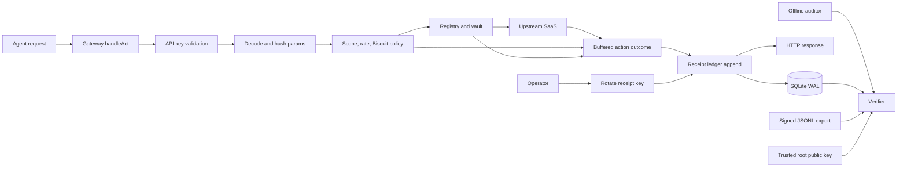

# Architecture Patterns

**Domain:** Signed action receipts for a brownfield Go API gateway
**Project:** AgentGate Receipts and OSS Launch
**Researched:** 2026-08-11
**Overall confidence:** HIGH for current code and receipt flow. MEDIUM for Biscuit issuance details.

## Problem

AgentGate must commit verifiable evidence for each authenticated action attempt.
The receipt path must not depend on the unused asynchronous audit logger.

The source differs from the existing architecture prose.
The design below follows the running request handler and production command.

## Source-Grounded Findings

| Claim in prose or PRD | Current source | Architecture consequence |
|---|---|---|
| Audit logging is wired into `/v1/act` | [`internal/gateway/gateway.go`](../../internal/gateway/gateway.go) only writes structured logs | Inject the receipt recorder into `gateway.Config` |
| The audit logger is the current request dependency | [`internal/audit/logger.go`](../../internal/audit/logger.go) has no gateway caller | Preserve it for compatibility, but do not extend it |
| Production uses SQLite | [`cmd/agentgw/main.go`](../../cmd/agentgw/main.go) never opens SQLite | Make the command the real composition root before first-boot key generation |
| Production uses the encrypted SQLite vault | The command constructs `vault.NewMemoryStore` | Open one database and construct `vault.NewSQLiteStore` |
| Database-backed auth and scopes are active | The handler authenticates against a plaintext map | Wire `auth.KeyStore` before recording policy decisions |
| Rate limiting is active | [`internal/ratelimit/limiter.go`](../../internal/ratelimit/limiter.go) has no production caller | Put rate limiting before upstream dispatch and receipt its decision |
| Proxy construction is delegated | `handleAct` builds and sends the upstream request itself | Attach receipts to `handleAct`, not the unused proxy package |
| Integration tests prove audit writes | The test creates an audit logger but never passes it to the gateway | Replace that dead setup with receipt assertions |
| Docker persists gateway state | Compose mounts `/data`, but the command stores tokens in memory | Add a database path and use the mounted volume |
| Docker provides the vault key expected by code | Compose sets `AGENTGATE_VAULT_KEY`; code reads `VAULT_ENCRYPTION_KEY` | Standardize one decoded 32-byte key before receipt work |

## Recommended Architecture



The gateway owns action execution and outcome collection.
The receipt ledger owns sequence allocation, key selection, signing, and persistence.
The verifier owns parsing and cryptographic validation.
Biscuit authorization is a separate policy input before vault access.

## Component Boundaries

| Component | Owning path | Responsibility | Communicates with |
|---|---|---|---|
| Composition root | `cmd/agentgw/main.go` | Open SQLite, migrate, decode keys, construct dependencies, register handlers | All runtime components |
| Action handler | `internal/gateway/gateway.go` | Authenticate, decode, authorize, call upstream, buffer outcome | Registry, vault, policy, recorder |
| Receipt protocol | `internal/receipt/receipt.go` | Types, fixed encoding, hashes, Ed25519 signatures | No database or HTTP code |
| SQLite ledger | `internal/receipt/ledger.go` | Allocate the next sequence and insert one signed row transactionally | SQLite, key manager |
| Key manager | `internal/receipt/keys.go` | First-boot generation, encrypted seeds, rotation, public history | SQLite, vault root key |
| Receipt HTTP handler | `internal/receipt/http.go` | Public keyset, bounded export, authenticated rotation | Ledger and admin authorization |
| Offline verifier | `internal/receipt/verifier.go` | Verify key transitions, rows, ranges, and manifests | Public inputs only |
| Verification command | `cmd/agentgate-verify/main.go` | Parse flags, select source, map failures to exit codes | Offline verifier |
| Biscuit policy | `internal/delegation/biscuit.go` | Verify token chain and evaluate request facts | Gateway policy stage |
| Legacy audit logger | `internal/audit/logger.go` | Existing best-effort audit table only | No receipt component |

### Dependency Injection

Keep the gateway dependency narrow.
The consumer should define the interface it needs.

```go
type ReceiptRecorder interface {
    Append(context.Context, receipt.Draft) (receipt.Receipt, error)
}

type AgentAuthorizer interface {
    Validate(context.Context, string) (*auth.AgentKey, error)
}

type RequestLimiter interface {
    Allow(agentKeyID, service string) bool
}

type DelegationAuthorizer interface {
    Authorize(context.Context, delegation.Request) (delegation.Decision, error)
}
```

`gateway.Config` receives these dependencies.
Tests can use small fakes without opening SQLite.

Do not define a generic storage plugin system.
SQLite is the only receipt backend in this milestone.

The receipt HTTP handler can depend on the concrete ledger.
The composition root mounts its exact routes before the gateway fallback handler.

## Receipt Protocol

### Canonical Fields

The receipt type follows the PRD fields.
Add an explicit `format_version` with value `1`.
Offline parsing otherwise has no safe evolution point.

The entry hash must cover every non-derived semantic field.
It must also cover `signer_kid` and `prev_hash`.
It excludes `entry_hash` and `signature`.

```text
entry_hash = SHA256(
    LP("agentgate.receipt.v1") ||
    LE64(seq) ||
    LE64(timestamp_unix_ns) ||
    LP(human_principal) ||
    LP(agent_key_id) ||
    LE32(delegation_chain_count) ||
    repeated LP(delegation_chain_item) ||
    LP(service) ||
    LP(action) ||
    params_sha256[32] ||
    LP(policy_decision) ||
    LE32(status_code) ||
    LE64(latency_ms) ||
    LP(error_code) ||
    prev_hash[32] ||
    LP(signer_kid)
)

signature = Ed25519.Sign(private_key, entry_hash)
```

`LP` is a little-endian `uint32` length followed by bytes.
Strings use UTF-8 bytes without normalization.
All integer ranges must be validated before encoding.

Use a domain separator instead of copying the core format byte-for-byte.
AgentGate fields have different meanings from operator audit fields.

Use lowercase hexadecimal for fixed binary values in JSONL.
The canonical hash never depends on JSON object ordering.

### Parameter Digest

Compute `params_sha256` immediately after request decoding.
Do not pass raw parameters into the receipt package.

Define one `canonicalParamsV1` function.
Decode numbers with `json.Decoder.UseNumber`.
Marshal the decoded parameter object with `encoding/json`.
Hash those bytes with SHA-256.

Golden tests must pin key order, whitespace handling, Unicode, numbers, and empty parameters.
Never hash `fmt.Sprint(map)`.
Never store the canonical parameter bytes.

### Stable Outcome Values

`policy_decision` has exactly three values:

| Value | Meaning |
|---|---|
| `allow` | Identity and policy checks allowed upstream processing |
| `deny` | A known authenticated request was rejected before upstream dispatch |
| `rate_limited` | The request was rejected by the configured limiter |

`status_code` is the HTTP status AgentGate intended to return.
An upstream HTTP status remains an `allow` decision.

Store a stable error code, such as `token_missing` or `delegation_denied`.
Do not sign raw network errors or token values.
Detailed diagnostics remain in structured process logs.

### Coverage Boundary

Receipt authenticated and syntactically valid `/v1/act` attempts.
Do not receipt unknown API keys or malformed JSON.
Those requests lack a trustworthy agent or action identity.

This narrows the PRD phrase "every `/v1/act` call."
The product claim should say "every authenticated action attempt."

## Exact Request Data Flow

1. Extract the API key from `X-AgentGate-Key` or `Authorization: Bearer`.
2. Validate it through `auth.KeyStore` and obtain the stable database key ID.
3. Decode `ActRequest` with `UseNumber` and validate required fields.
4. Compute `params_sha256` before any policy or upstream work.
5. Check `AllowedServices` and `AllowedUsers` on the validated key.
6. Apply the per-agent, per-service rate limiter.
7. Verify and authorize the optional Biscuit delegation token.
8. Resolve the service and action from the registry.
9. Fetch the human principal's token from the SQLite vault.
10. Build and execute the upstream request using the current request context.
11. Convert every post-decode exit into one buffered `ActionOutcome`.
12. Build a receipt draft without raw parameters, OAuth tokens, or response bodies.
13. Append the receipt with a bounded context derived from `context.WithoutCancel`.
14. Write the buffered HTTP outcome only after the receipt transaction commits.

Receipt sequence order is commit order.
It is not request arrival order or upstream dispatch order.

The handler must not call `writeJSON` inside the action execution function.
Early writes would make receipt failure impossible to report consistently.

A suitable local split is:

```go
func (s *Server) handleAct(w http.ResponseWriter, r *http.Request) {
    attempt, immediate := s.prepareAttempt(r)
    if immediate != nil {
        immediate.Write(w)
        return
    }

    outcome := s.executeAttempt(r.Context(), attempt)
    receiptCtx, cancel := context.WithTimeout(context.WithoutCancel(r.Context()), 5*time.Second)
    defer cancel()

    if _, err := s.cfg.Receipts.Append(receiptCtx, outcome.ReceiptDraft()); err != nil {
        s.logger.Error("receipt append failed", "error", err)
        writeJSON(w, http.StatusInternalServerError, receiptFailureResponse)
        return
    }
    outcome.Write(w)
}
```

`prepareAttempt` leaves unauthenticated and malformed requests outside receipt coverage.
`executeAttempt` performs no response writes.

## SQLite Schema

Migration `002_receipts.sql` should create key history and immutable receipts.
It must not alter `audit_log`.

### `receipt_keys`

| Column | Type | Constraint |
|---|---|---|
| `kid` | TEXT | Primary key; SHA-256 fingerprint of public key |
| `public_key` | BLOB | Exactly 32 bytes |
| `private_seed_enc` | BLOB | Encrypted 32-byte seed; nullable after retirement |
| `activated_seq` | INTEGER | First sequence permitted for this key |
| `retired_after_seq` | INTEGER | Last sequence permitted; nullable while active |
| `previous_kid` | TEXT | Previous key; null only for the trust anchor |
| `transition_signature` | BLOB | 64-byte signature by the previous key |
| `created_unix_ns` | INTEGER | Positive integer |
| `retired_unix_ns` | INTEGER | Nullable |
| `active` | INTEGER | Boolean with one-row partial unique index |

### `receipts`

| Column | Type | Constraint |
|---|---|---|
| `seq` | INTEGER | Primary key and positive |
| `format_version` | INTEGER | Must equal `1` |
| `timestamp_unix_ns` | INTEGER | Positive integer |
| Identity and action fields | TEXT | Not null |
| `delegation_chain_json` | TEXT | Ordered JSON array; default `[]` |
| `params_sha256` | BLOB | Exactly 32 bytes |
| `policy_decision` | TEXT | Checked enum |
| `status_code` | INTEGER | Checked HTTP range |
| `latency_ms` | INTEGER | Non-negative |
| `error_code` | TEXT | Not null; empty means no error |
| `prev_hash` | BLOB | Exactly 32 bytes |
| `entry_hash` | BLOB | Unique and exactly 32 bytes |
| `signer_kid` | TEXT | Foreign key to `receipt_keys` |
| `signature` | BLOB | Exactly 64 bytes |

Add indexes only for `timestamp_unix_ns`, `agent_key_id`, and `(service, action)`.
The primary key already supports sequence export.

Add triggers that reject `UPDATE` and `DELETE` on `receipts`.
They prevent accidents, but they are not the tamper-evidence mechanism.

Enable foreign keys explicitly.
SQLite does not enable them automatically for every connection.

## Synchronous Sequencing and Concurrency

### No-Gap Invariants

The committed ledger must satisfy all these conditions:

1. The empty ledger has head sequence `0` and a zero previous hash.
2. The next committed row has `seq = current_head + 1`.
3. Its `prev_hash` equals the current head's `entry_hash`.
4. Sequence allocation and insertion occur in one write transaction.
5. Failed transactions consume no sequence value.
6. The in-memory head is never authoritative.
7. Restart loads the next sequence from committed SQLite state.
8. Concurrent requests serialize only during the short append transaction.

Do not hold the ledger lock during the SaaS request.
That would serialize unrelated network latency.

### Append Transaction

Use one process mutex to reduce local contention.
Use `BEGIN IMMEDIATE` to establish the cross-connection write order.

Within that transaction:

1. Read the active signing key row.
2. Read the last receipt using `ORDER BY seq DESC LIMIT 1`.
3. Set the next sequence and previous hash.
4. Set the timestamp through an injected clock.
5. Compute the entry hash and Ed25519 signature.
6. Insert the full receipt row.
7. Commit the transaction.
8. Return the receipt only after commit succeeds.

Configure the driver with these properties:

```text
_journal_mode=WAL
_busy_timeout=5000
_foreign_keys=on
_txlock=immediate
_synchronous=FULL
```

The pinned `go-sqlite3 v1.14.44` bundle contains SQLite 3.53.0.
That version includes the 2026 WAL-reset fix.

SQLite allows one writer at a time.
WAL still permits export and verification reads during appends.

### Cheap Discriminating Test

Run 100 concurrent authenticated `/v1/act` calls against a mock upstream.
Then verify sequences `1..100`, every previous hash, every signature, and the final head.

Repeat after constructing a fresh ledger over the same database.
The next row must be sequence `101`.

Inject an insert error before commit.
The following successful append must reuse the uncommitted sequence.

## Key Management and Rotation

### Private Key Storage

Generate an Ed25519 keypair on the first persistent boot.
Store the public key in cleartext.
Encrypt only the 32-byte private seed with AES-256-GCM.

Use the same decoded root key supplied to the token vault.
Bind encryption with AAD containing `agentgate.receipt-key.v1` and the `kid`.
Use a fresh random nonce for every encrypted seed.

Do not route signing keys through `vault.Store`.
That interface models OAuth tokens by human and service.

Do not use a random process key when receipts are enabled.
A missing, malformed, or changed vault key must stop startup before listening.
A decryption failure must never create a replacement signing key silently.

Derive `kid` from the full SHA-256 public-key fingerprint.
Encode it with unpadded base64url.
The verifier recomputes and checks this value.

### Rotation Transaction

Rotation shares the ledger append mutex.
It also uses `BEGIN IMMEDIATE`.

1. Read the current head and active key.
2. Generate the next Ed25519 keypair.
3. Set `activated_seq = head + 1`.
4. Sign a domain-separated transition with the old key.
5. Mark the old key retired after `head`.
6. Insert the new active key and encrypted seed.
7. Commit both changes atomically.
8. Drop the retired private seed after the transition is durable.

The transition payload is:

```text
LP("agentgate.receipt-key-transition.v1") ||
LP(previous_kid) ||
LP(next_kid) ||
next_public_key[32] ||
LE64(activated_seq)
```

A receipt signer must be active for that receipt's sequence.
The verifier must reject old-key signatures after rotation.

### Verifier Trust Model

A public key embedded beside a receipt is self-asserted.
It cannot establish that AgentGate produced the receipt.

Use one pinned initial public key as the offline trust anchor.
Verify each later public key through its signed transition.
Then select receipt keys by `signer_kid` and sequence interval.

`GET /v1/receipts/pubkey` should return the full public key history.
Keep the PRD route for compatibility, even though its response is a keyset.

The endpoint returns no private material.
An auditor saves the initial public key through a trusted channel.
The offline verifier never fetches keys from the network.

This model avoids requiring every historical private key.
It still retains every historical public key and transition.

## Export Architecture

Register these exact routes in the receipt HTTP handler:

| Route | Access | Purpose |
|---|---|---|
| `GET /v1/receipts/pubkey` | Public | Current and historical public key transitions |
| `GET /v1/receipts/export?from=&to=` | Admin | Signed bounded JSONL artifact |
| `POST /admin/receipts/keys/rotate` | Admin | In-process transactional rotation |

The export endpoint contains human principals and action metadata.
It must use the existing admin-secret policy.

### JSONL Artifact

Use typed lines rather than unversioned receipt objects.
The first line is a signed export manifest.
Key transition lines follow, then receipt lines in sequence order.

The manifest binds:

- Format version.
- Requested `from` and resolved `to`.
- Receipt count.
- Sequence and hash immediately before `from`.
- First and last exported entry hashes.
- Database head sequence and hash at snapshot time.
- Canonical keyset digest.
- Manifest signer key ID and signature.

For `from=1`, the anchor is sequence `0` with a zero hash.
A bounded export begins verification from its signed anchor.

Read the manifest inputs and receipt range in one SQLite snapshot transaction.
Set a maximum range and return `400` for invalid bounds.
Return `application/x-ndjson`.

The verifier must reject missing manifests, count changes, reordered rows, and truncated ranges.
It must distinguish a partial range from a complete ledger.

### Deletion Limits

A chain detects deletion inside the observed range.
It cannot detect deletion of an unknown final suffix without a trusted head.

The signed export manifest supplies that expected head for an exported artifact.
Raw SQLite verification needs `--expected-head` or a trusted prior manifest.

Rekor mirroring remains out of scope.
Do not claim universal tail-deletion detection before external checkpoints exist.

### SQLite Snapshot Safety

Do not copy only the database file while the server is running in WAL mode.
Committed rows may still reside in the `-wal` file.

Use the HTTP JSONL export or SQLite backup API for portable snapshots.
The direct SQLite verifier may read a live local database read-only.

## Offline Verification

Put all verification logic in `internal/receipt/verifier.go`.
The CLI should only adapt inputs and format reports.

Verification order is fixed:

1. Parse the trusted root public key.
2. Parse and validate every key record length and fingerprint.
3. Verify the key-transition chain from the pinned root.
4. Validate key activation intervals.
5. Validate manifest signature and range metadata when present.
6. Require exact sequence progression for the declared range.
7. Compare each `prev_hash` with the expected previous hash.
8. Recompute each entry hash from canonical fields.
9. Resolve `signer_kid` and check its sequence interval.
10. Verify the 64-byte Ed25519 signature.
11. Compare the final row with the manifest or expected head.

Support these input adapters:

```text
agentgate-verify --source sqlite --path ./data/agentgate.db --trust-root root.pub
agentgate-verify --source jsonl --path receipts.jsonl --trust-root root.pub
agentgate-verify --source jsonl --path - --trust-root root.pub
```

Exit codes remain:

| Code | Meaning |
|---|---|
| `0` | All requested checks passed |
| `1` | Chain, key, signature, manifest, or expected-head mismatch |
| `2` | I/O, syntax, unsupported version, or configuration error |

The SQLite adapter must query `ORDER BY seq ASC`.
The JSONL adapter must reject duplicate fields and unknown line versions.

Do not load private keys in the verifier.
Do not import server configuration or call the public-key endpoint.

## Biscuit Delegation

### Boundary

Biscuit is an authorization input, not a receipt signing primitive.
Place it after API-key scope checks and before vault access.

Use `X-AgentGate-Delegation` for the Biscuit token.
Keep `X-AgentGate-Key` or bearer authorization for the existing API key.
Do not overload one bearer header with two credentials.

The delegation component receives immutable request facts:

- Stable agent key ID.
- Human principal.
- Service.
- Action.
- Parameter digest.
- Current time.

It returns:

- `allow` or `deny`.
- A stable denial code.
- Ordered delegation block identifiers after cryptographic verification.

Populate `delegation_chain` with ordered SHA-256 digests of Biscuit revocation identifiers.
Do not store the Biscuit token, Datalog source, or raw caveats.
The first digest identifies the parent authority block.

### Parent Binding

The Biscuit authority block must bind the human principal and agent key ID.
The authorizer must compare both values against the request.
It must also check service and action authority.

Biscuit verifies its append-only block signature chain against a configured root public key.
Version 1 signatures bind each block to the previous signature.
A block copied between unrelated chains must fail verification.

Test splicing with two valid tokens from the same root.
Move an attenuation block from chain A into chain B.
The library and gateway authorizer must reject the result.

Also test a valid chain against the wrong agent key and human principal.
Both requests must produce signed `deny` receipts without reaching the vault.

### Standards Position

The current attenuating-agent-token draft defines JWT-based AATs.
Biscuit is not an implementation of that wire format.

The on-behalf-of-user draft defines OAuth actor binding.
It does not define Biscuit issuance.

Cite both drafts as design context only.
Do not claim standards compliance or wire compatibility.
Biscuit issuance and root-key distribution need phase-specific design before R7.

## Failure Behavior

| Failure | Upstream called | Receipt attempt | Client result |
|---|---:|---:|---|
| Unknown or revoked API key | No | No | `401` |
| Malformed JSON or missing identity fields | No | No | `400` |
| Scope or Biscuit denial | No | Yes | `403` after receipt commit |
| Rate limit | No | Yes | `429` after receipt commit |
| Unknown service or action | No | Yes | `404` after receipt commit |
| Token missing or expired | No | Yes | `403` after receipt commit |
| Upstream network failure | Attempted | Yes | `502` after receipt commit |
| Upstream HTTP error | Yes | Yes | Upstream status after receipt commit |
| Receipt append failure | Maybe | Failed | `500`; never return upstream success |
| Response write failure | Maybe | Already committed | Log transport failure only |

A client cancellation must not cancel post-action receipt persistence immediately.
Use a bounded uncancelled context for the append.

There is no atomic transaction spanning SQLite and an external SaaS side effect.
A SaaS action can complete before a later receipt append fails.

The milestone can guarantee two narrower properties:

1. No successful HTTP outcome is returned before its receipt commits.
2. Committed receipt sequences contain no allocation gaps.

Do not claim exactly-once evidence under disk failure.
That requires an intent/completion protocol outside the current receipt schema.

## Migration Safety

[`internal/db/sqlite.go`](../../internal/db/sqlite.go) currently reruns every embedded file.
It has no migration ledger and no explicit per-file transaction.

Before adding `002_receipts.sql`:

1. Create `schema_migrations` if absent.
2. Sort migration filenames lexically.
3. Run each unapplied file inside one transaction.
4. Insert its filename only after all statements succeed.
5. Roll back the whole file on any error.
6. Keep `001_init.sql` idempotent for existing databases.

`002_receipts.sql` is additive.
It creates receipt tables, indexes, constraints, and immutability triggers.
It leaves all three existing tables unchanged.

Test migration against a populated `001` database.
Test a second migration run as a no-op.
Test a forced statement failure leaves no partial receipt schema.

R3 needs this migration because first-boot key persistence precedes request wiring.
The PRD assigns the migration to R4, which is one task too late.

## Closest Existing Analogs

| Analog | Reuse | Required change |
|---|---|---|
| [`agentic-operator-core/pkg/audit/chain.go`](../../../agentic-operator-core/pkg/audit/chain.go) | Length-prefixed hashing, fixed-width integers, clock seam | New fields, domain separator, Ed25519, 64-byte signatures |
| [`agentic-operator-core/pkg/audit/recorder.go`](../../../agentic-operator-core/pkg/audit/recorder.go) | Synchronous append shape and concurrency tests | Compute head and insert inside one SQLite transaction |
| [`agentic-operator-core/pkg/audit/verifier.go`](../../../agentic-operator-core/pkg/audit/verifier.go) | Ordered walk, first-error report, key selection | Public-key history, range anchors, signed manifests |
| [`agentic-operator-core/cmd/audit-verify/main.go`](../../../agentic-operator-core/cmd/audit-verify/main.go) | Input adapters and exit codes | SQLite source and trusted Ed25519 roots |
| [`internal/vault/sqlite_store.go`](../../internal/vault/sqlite_store.go) | AES-GCM nonce and ciphertext storage | Encrypt Ed25519 seeds with type-specific AAD |
| [`tests/integration/gateway_test.go`](../../tests/integration/gateway_test.go) | Full HTTP fixture and mock upstream | Use real migrations, ledger, and receipt verification |

Do not port the HMAC verifier.
Anyone holding an HMAC verification key can forge entries.

Do not copy the core recorder's separate `Head` and `Append` calls.
That split is unsafe across concurrent SQLite writers.

## Anti-Patterns to Avoid

### Extending the Buffered Audit Logger

**What:** Add hashes and signatures inside `audit.Logger.drain`.

**Why bad:** Its channel drops entries and cannot block the HTTP response.

**Instead:** Use a synchronous receipt ledger injected into `gateway.Server`.

### In-Memory Sequence State

**What:** Increment an atomic counter and persist later.

**Why bad:** Crashes, restarts, and insert failures create divergence.

**Instead:** Allocate from the committed head inside the append transaction.

### Trusting Exported Keys Automatically

**What:** Accept any public key included beside a receipt.

**Why bad:** An attacker can replace receipts and keys together.

**Instead:** Pin the initial root and verify signed key transitions.

### Signing JSON

**What:** Sign marshaled receipt JSON.

**Why bad:** Encoders can differ in ordering and escaping.

**Instead:** Sign the fixed binary entry hash and treat JSONL as transport.

### Storing Delegation Tokens

**What:** Persist the full Biscuit token in a receipt.

**Why bad:** It exposes policy details and expands the audit artifact.

**Instead:** Store ordered digests of verified block identifiers.

### Treating Drafts as Shipped Standards

**What:** Claim Biscuit implements the IETF AAT draft.

**Why bad:** The draft currently specifies JWT credentials, not Biscuit tokens.

**Instead:** Describe shared goals and state the wire-format difference.

## Dependency-Ordered Implementation

1. **R1: License first**
   - Add Apache 2.0 materials before accepting receipt contributions.

2. **R2: Pure receipt protocol**
   - Define fields, version, canonical encoding, parameter digest, hashes, and Ed25519 tests.
   - No SQLite or HTTP code belongs here.

3. **R3: Persistence and key trust**
   - Make migration execution transactional.
   - Add `002_receipts.sql`.
   - Open SQLite in the production command.
   - Switch production to `vault.NewSQLiteStore`.
   - Add first-boot keys, encrypted seeds, transitions, rotation, and public keyset output.

4. **R4: Ledger and owning request path**
   - Implement transactional append.
   - Inject it into `gateway.Config`.
   - Wire database auth and rate limiting.
   - Refactor action execution to buffer outcomes.
   - Append before response writes.
   - Add concurrency, restart, cancellation, and failure-injection tests.

5. **R5: Offline verifier**
   - Add pure verification, SQLite and JSONL adapters, root pinning, and exact exit codes.
   - Add modified, interior-deleted, inserted, forged, rotated-key, and truncated-range tests.

6. **R9: Launch quickstart**
   - Wire existing OAuth and admin handlers in the production composition root.
   - Fix Docker environment names and database path.
   - Prove clone to locally verified SQLite receipt before launch.

7. **R6: Signed bounded export**
   - Add snapshot reads, manifest signing, key history lines, and JSONL round-trip tests.

8. **R7: Biscuit delegation**
   - Define the issuance contract and request facts first.
   - Add pre-vault authorization, block digests, denial receipts, and splice tests.

R6 and R7 both depend on the R2 protocol.
R6 also depends on the R5 verifier.
R7 depends on the R4 outcome pipeline.

## Validation Map

| Concern | Focused check |
|---|---|
| Canonical encoding | Golden bytes and signature with fixed key, clock, and input |
| Parameter privacy | Search receipt rows and JSONL for known secret parameter values |
| No gaps | 100 concurrent HTTP calls followed by full verifier walk |
| Restart safety | Append, reconstruct ledger, append next sequence |
| Transaction rollback | Inject insert and commit failures, then append successfully |
| Rotation | Verify old and new rows from one pinned root |
| Key misuse | Reject old-key signatures after its retirement sequence |
| Key substitution | Replace receipts and exported keyset, keep pinned root unchanged |
| Tamper detection | Modify, delete internally, insert, reorder, and forge separately |
| Export bounds | Verify a non-`1` range from its signed anchor |
| Export truncation | Remove first or last receipt while retaining the manifest |
| Cancellation | Cancel the request after upstream completion and observe a receipt |
| Receipt failure | Force SQLite failure and assert no upstream success response |
| Biscuit binding | Wrong human, wrong agent, and cross-chain splice tests |
| Migration | Upgrade a populated `001` database twice |

## Scalability Boundary

The current milestone is one single-tenant process with one local SQLite file.
No request-volume target exists beyond the PRD latency gate.

Measure append duration separately from upstream latency.
Revisit the design only if synchronous receipt overhead exceeds 50 ms at p99.

Do not add a queue to improve latency.
A queue would weaken the response-before-commit invariant.

Do not add PostgreSQL or distributed sequencing in this milestone.
A second writer host would require a new coordination design.

## What This Explicitly Does Not Do

- It does not replace `audit_log`.
- It does not store raw action parameters.
- It does not store SaaS response bodies.
- It does not make SQLite and SaaS calls atomic together.
- It does not detect unknown tail deletion without a trusted head.
- It does not publish Rekor checkpoints.
- It does not define a new delegation token format.
- It does not claim Biscuit compatibility with a JWT draft.
- It does not add a second receipt storage backend.

## Confidence Assessment

| Area | Confidence | Reason |
|---|---|---|
| Owning request path | HIGH | Direct source tracing identifies `gateway.handleAct` |
| SQLite composition gap | HIGH | Production command never opens the existing database package |
| Sequencing model | HIGH | SQLite transaction rules and one-writer behavior are documented |
| Ed25519 protocol | HIGH | Go standard library defines fixed key and signature sizes |
| Key rotation model | HIGH | It uses a pinned root and explicit signed transitions |
| Export completeness | HIGH | Signed bounds resolve artifact truncation; external heads remain necessary |
| Biscuit boundary | MEDIUM | Verification is documented, but AgentGate issuance is unspecified |
| IETF alignment | HIGH | Current AAT draft is JWT-based and differs from Biscuit |

## Sources

### Repository Sources

- [`internal/gateway/gateway.go`](../../internal/gateway/gateway.go)
- [`cmd/agentgw/main.go`](../../cmd/agentgw/main.go)
- [`internal/audit/logger.go`](../../internal/audit/logger.go)
- [`internal/db/sqlite.go`](../../internal/db/sqlite.go)
- [`internal/db/migrations/001_init.sql`](../../internal/db/migrations/001_init.sql)
- [`internal/vault/sqlite_store.go`](../../internal/vault/sqlite_store.go)
- [`internal/auth/keys.go`](../../internal/auth/keys.go)
- [`internal/ratelimit/limiter.go`](../../internal/ratelimit/limiter.go)
- [`tests/integration/gateway_test.go`](../../tests/integration/gateway_test.go)
- [`PRD-receipts-oss.md`](../../PRD-receipts-oss.md)
- [`agentic-operator-core/pkg/audit/chain.go`](../../../agentic-operator-core/pkg/audit/chain.go)
- [`agentic-operator-core/pkg/audit/recorder.go`](../../../agentic-operator-core/pkg/audit/recorder.go)
- [`agentic-operator-core/pkg/audit/verifier.go`](../../../agentic-operator-core/pkg/audit/verifier.go)
- [`agentic-operator-core/cmd/audit-verify/main.go`](../../../agentic-operator-core/cmd/audit-verify/main.go)

### Authoritative External Sources

- Go Ed25519 package: https://pkg.go.dev/crypto/ed25519
- SQLite transactions: https://www.sqlite.org/lang_transaction.html
- SQLite WAL behavior and 2026 fix: https://www.sqlite.org/wal.html
- Biscuit Go usage: https://doc.biscuitsec.org/usage/go
- Biscuit specification: https://github.com/eclipse-biscuit/biscuit/blob/main/SPECIFICATIONS.md
- Attenuating Agent Tokens draft 01: https://datatracker.ietf.org/doc/draft-niyikiza-oauth-attenuating-agent-tokens/01/
- OAuth AI Agents On-Behalf-Of User draft 02: https://datatracker.ietf.org/doc/draft-oauth-ai-agents-on-behalf-of-user/02/
